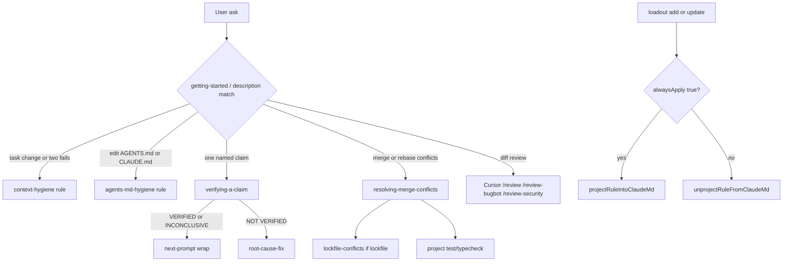

# Plan: Adopt 2026 Cursor practice (shrink always-on, fill four holes)

## 1. Summary

- Problem: The catalog already has 59 skills and 38 rules, including 7 `alwaysApply` rules. 2026 Cursor/Anthropic guidance is thin always-on context, skills on demand, and native review/loop surfaces. The gap is invocation and always-on bloat, not missing coverage. Four named holes remain: `context-hygiene`, `agents-md-hygiene`, `verifying-a-claim`, `resolving-merge-conflicts`. A fifth hole the first draft missed: `loadout add` / `update` projects **every** cursor-rule body into `CLAUDE.md` ([cli/src/lib/project.ts](cli/src/lib/project.ts) `planTargets` + `projectRuleIntoClaudeMd`), so a Cursor glob/agent-requested rule becomes Claude always-on.
- Outcome: Always-on shrinks by one language rule **on Cursor** (glob attach) **and on Claude** (stop projecting non-`alwaysApply` bodies; unproject them on `update`). Consumer starter stays kit-opt-in for shared trunk. Four assets ship with registry/docs/tests. Catalog and usage point at Cursor-native `/review`, `/review-bugbot`, `/review-security`, `/loop`, `/autopilot`, `/canvas` instead of reinventing them.
- Approach: Single-loop change to this loadout repo. T-01 is the smallest validating slice (two agent-requested/glob rules + template tighten + native-surface pointers). Then demote `no-inline-imports` **and** fix Claude projection. Then the two skills. Then the cross-cutting DoD sweep (counts from registry, versions, doctor, tests).

## 2. Scope

### In scope

- New agent-requested rule `rules/context-hygiene.mdc` + registry id `context-hygiene`.
- New glob + description rule `rules/agents-md-hygiene.mdc` + registry id `agents-md-hygiene`.
- Tighten [templates/AGENTS.md](templates/AGENTS.md) and [templates/CLAUDE.md](templates/CLAUDE.md) to the same litmus (situational knowledge belongs in a skill; nested `AGENTS.md` wins).
- Demote [rules/no-inline-imports.mdc](rules/no-inline-imports.mdc) from `alwaysApply: true` to `alwaysApply: false` with an explicit six-string `globs` array (not a brace glob).
- CLI: project a rule into `CLAUDE.md` only when `alwaysApply: true`. On `add`/`update`, unproject a previously inserted `<!-- rule:<id> -->` block when the current file is not always-on. Tests in [cli/src/lib/project.test.ts](cli/src/lib/project.test.ts). Call sites: [cli/src/lib/install.ts](cli/src/lib/install.ts), [cli/src/commands/update.ts](cli/src/commands/update.ts).
- Shared-trunk wording: keep `git-safety` / `no-stash` / `shared-working-tree` as `alwaysApply: true` on the shipped files. Catalog Always-on table annotates **all three** as "shared-trunk kit — always-on when that kit is installed" (not starter). `kits.starter` unchanged.
- New skill `plugins/core-engineering/skills/verifying-a-claim/` plus thin command `/verify-claim` (`verify-claim.md`) and next-prompt fence test. Registry command id: **`verify-claim-cmd`** only.
- New skill `plugins/core-engineering/skills/resolving-merge-conflicts/` (no command file; invoke via `/resolving-merge-conflicts` or the rebase skill). `disable-model-invocation: true`.
- Docs: [docs/catalog.md](docs/catalog.md), [docs/usage.md](docs/usage.md), [INSTALL.md](INSTALL.md), [docs/external-practices.md](docs/external-practices.md), [docs/agentic-patterns.md](docs/agentic-patterns.md), [plugins/core-engineering/skills/getting-started/SKILL.md](plugins/core-engineering/skills/getting-started/SKILL.md). Confirm [processes/runbooks/bootstrap-project.md](processes/runbooks/bootstrap-project.md) already omits `no-inline-imports` from day-one add (it does; no edit unless a sentence still calls it universal always-on).
- Registry + marketplace/plugin version bump for `core-engineering`: increment whatever is on disk (today 0.19.0 → 0.20.0). If another agent already bumped, increment from the new value so marketplace.json and plugin.json stay equal.
- Tests: extend `next-prompt-fence.test.mjs`; add `rules/frontmatter-modes.test.mjs` (AC-01–AC-04, AC-11); extend `project.test.ts` (AC-10); append both new test paths to the explicit `package.json` `test` list (it is not a glob).
- `recommending-next-steps` is on HEAD (`7b17890`), not dirty WIP. Catalog/usage/registry already include it (59 skills / 38 rules). When editing those files, add rows; do not remove the next-steps rows.

### Non-goals (with rationale)

- Community skill packs or converting skills into always-on rules — Cursor 2026 and this repo's `audit-external-skills` reject that path.
- New `alwaysApply: true` rules — the point is to shrink always-on.
- Rewriting flight or plan-build families — already aligned.
- Cloud Automations as a loadout skill — use Cursor `/automate` / `/autopilot` natively.
- Splitting `rules/` into Remote-Rules subfolders — larger distribution change; warn in INSTALL/usage instead.
- Vendoring glob/agent-requested rules into Claude Code `.claude/rules/` with `paths` — Claude now supports path-scoped rules ([memory docs](https://code.claude.com/docs/en/memory)); mapping `.mdc` globs → `paths` is a CLI rewrite on the same scale as splitting `rules/`. This plan stops the wrong always-on dump. Path-scoped Claude vendoring stays a named non-goal.
- Changing `kits.starter` contents — already correct (no shared-trunk, no `no-inline-imports`).
- User-level `~/.cursor/rules` edits — those are the operator's Waveguide copy, not this repo.
- A `/resolve-conflicts` command file — `rebasing-a-branch` has no command; keep that pair consistent. `/skill-name` still works.
- Replacing native `/review` or Bugbot with a `generalPurpose` Task.
- Adding `verifying-a-claim` or `resolving-merge-conflicts` to workflow `uses:` in `ship-a-feature` / `plan-then-build` / `clear-the-queue` — `loadout update` would then vendor those skills to every consumer who has those workflows. Registry `workflows` metadata only.
- Copying Team Kit files or the `/tmp/verify-this/<slug>/` artifact tree.
- Auto-invoking the merge-conflict skill (Team Kit does; this repo's `git-safety` does not).

### Assumptions (labeled; must not block implementation)

- A-1: The create-plan prompt's "smallest slice" is T-01. The full recommended set is still this plan's ship set (T-01 through T-05).
- A-2: "Keep shared-trunk always-on in this repo" means the shipped `.mdc` files stay `alwaysApply: true`. Consumer default is already kit-opt-in in [INSTALL.md](INSTALL.md) lines 124–134. Catalog must annotate `git-safety` with the kit, not only `no-stash` / `shared-working-tree` (bootstrap puts all three in the optional kit).
- A-3: Remote Rules of the whole `rules/` tree still pulls every always-on rule. Document the footgun; do not restructure directories.
- A-4: No repo-root CHANGELOG.md exists. User-facing surfaces are catalog, usage, INSTALL, and plugin version.
- A-5: `verifying-a-claim` is diagnose/review (next-prompt fence). `resolving-merge-conflicts` is an implement skill (no fence). `/verify-surfaces` is **not** in `REQUIRED` today and has no fence; `/verify-claim` still goes on `REQUIRED` because it is diagnose + next-prompt (same family as `/deep-dive`, not `/verify-surfaces`).
- A-6: Registry on HEAD has 59 skills and 38 cursor-rules (`python` Counter on [registry.json](registry.json); catalog headers match). After this plan's two skills + two rules, headers are 61 / 40 **unless** another asset lands first. T-05 counts from `registry.json` and writes those numbers; do not hard-fail the build on a stale 61/40 if the live count differs.
- A-7: `pairs_with` may only list registry ids or `rules/<id>.mdc` basenames. `next-prompt` is a shared markdown file, not an asset. Do not put `next-prompt` in `pairs_with` (doctor error: `pairs_with references nothing`).
- A-8: HTML comments in `CLAUDE.md` are stripped from Claude's injected context; rule **bodies** in the managed block are not. Unproject must delete the body, not only the marker.

### Open questions

<!-- Must be EMPTY at delivery. -->

## 3. Current state (in-repo, evidence-based)

- What exists today:
  - 59 skills, 38 rules, 7 `alwaysApply: true`: `no-shortcuts`, `regression-test`, `no-inline-imports`, `no-secrets-in-code`, `git-safety`, `no-stash`, `shared-working-tree` ([docs/catalog.md](docs/catalog.md) § Rules). Grep of [registry.json](registry.json): 59 `"type": "skill"`, 38 `"type": "cursor-rule"`.
  - `no-any` already shows the demotion pattern: `globs: ["**/*.ts", "**/*.tsx"]`, `alwaysApply: false` ([rules/no-any.mdc](rules/no-any.mdc)).
  - `kits.starter` is routing + `ship-a-feature` + `plan-then-build` + `no-secrets-in-code` + `definition-of-done` ([registry.json](registry.json)). Shared-trunk is optional in [INSTALL.md](INSTALL.md) and [processes/runbooks/bootstrap-project.md](processes/runbooks/bootstrap-project.md) (`git-safety no-stash shared-working-tree committing-on-shared-trunk`). Day-one bootstrap add is `no-shortcuts size-limits regression-test no-secrets-in-code definition-of-done` — no `no-inline-imports`.
  - `verifying-session-surfaces` neighbor row still says one named claim uses "same evidence rules; inventory can be one row" — it does not yet route to `verifying-a-claim` ([plugins/core-engineering/skills/verifying-session-surfaces/SKILL.md](plugins/core-engineering/skills/verifying-session-surfaces/SKILL.md) lines 49–50).
  - `rebasing-a-branch` step 3 is inline semantic resolve; `disable-model-invocation: true`; no dedicated conflict skill ([plugins/core-engineering/skills/rebasing-a-branch/SKILL.md](plugins/core-engineering/skills/rebasing-a-branch/SKILL.md)).
  - `docs/external-practices.md` §5 items 3 and 5 still say CLAUDE.md hygiene and rule-author "reference don't paste" are unfinished; §6 lists `verifying-a-claim` and `resolving-merge-conflicts` as superseded candidates that were never built. §6 verdict string is `VERIFIED/NOT/INCONCLUSIVE`; ship `NOT VERIFIED` (three-token Team Kit form).
  - Doctor requires every `.mdc` to have `description`; `globs` must be an **array**; warns when `alwaysApply` body exceeds 1500 chars; `pairs_with` must resolve to an asset id or `rules/<id>.mdc`; catalog `## Skills (N)` / `## Rules (N)` mismatch is a **warning**, not an error ([cli/src/commands/doctor.ts](cli/src/commands/doctor.ts) `checkDocsSync`, `checkRegistry`).
  - Diagnose/review commands in `REQUIRED` must contain a literal ` ```text ` fence ([plugins/core-engineering/commands/next-prompt-fence.test.mjs](plugins/core-engineering/commands/next-prompt-fence.test.mjs)). `verify-surfaces.md` is not on that list.
  - Plugin/marketplace version is 0.19.0 ([.claude-plugin/marketplace.json](.claude-plugin/marketplace.json), [plugins/core-engineering/.claude-plugin/plugin.json](plugins/core-engineering/.claude-plugin/plugin.json)).
  - `package.json` `test` is an explicit file list (not a glob). New test files do not run unless appended.
  - Claude projection: every `cursor-rule` `add`/`update` copies `.mdc` **and** appends the stripped body to `CLAUDE.md` ([cli/src/lib/project.ts](cli/src/lib/project.ts) lines 63–72, 183–210; [cli/src/lib/install.ts](cli/src/lib/install.ts) 87–90; [cli/src/commands/update.ts](cli/src/commands/update.ts) 88–90). [docs/usage.md](docs/usage.md) line 48 states this as current behavior and also claims Claude has "no native `.mdc`" — that sentence is stale (Claude has `.claude/rules/` + `paths`).
- Gaps / constraints:
  - No `context-hygiene` or `agents-md-hygiene` rule files.
  - Catalog "Always on" lists shared-trunk and `no-inline-imports` without saying which are starter vs kit; `git-safety` is drawn as universal even though INSTALL puts it in the optional kit.
  - Usage documents how rules load but does not name Cursor built-in skills as the review/loop path.
  - `getting-started` does not route one-claim verify or merge conflicts, and does not name `/review` / Bugbot / `/loop`.
  - Claude consumers who `loadout add` a glob or agent-requested rule pay always-on tokens.
- Reusable components:
  - `rule-author` / `skill-author` house style.
  - Agent-requested rule shape: [rules/deep-dive.mdc](rules/deep-dive.mdc).
  - Thin skill shape: [plugins/core-engineering/skills/writing-commit-messages/SKILL.md](plugins/core-engineering/skills/writing-commit-messages/SKILL.md).
  - Next-prompt: [plugins/core-engineering/skills/_shared/next-prompt.md](plugins/core-engineering/skills/_shared/next-prompt.md).
  - Thin command wrapper: [plugins/core-engineering/commands/next-steps.md](plugins/core-engineering/commands/next-steps.md).
  - Command registry shape: `verifying-session-surfaces-cmd` → source `commands/verify-surfaces.md` (id `verify-claim-cmd`, source `commands/verify-claim.md`).
- Files read (path — why):
  - `plugins/core-engineering/skills/create-plan/SKILL.md` — delivery contract
  - `rules/create-plan.mdc`, `rules/review-plan.mdc` — completeness bar
  - `plugins/core-engineering/skills/_shared/plan-build-family.md` — routing
  - `plugins/meta/skills/rule-author/SKILL.md`, `skill-author/SKILL.md` — authoring
  - `rules/no-inline-imports.mdc`, `rules/no-any.mdc`, `rules/deep-dive.mdc`, `rules/definition-of-done.mdc`
  - `docs/catalog.md`, `docs/usage.md`, `INSTALL.md`, `docs/external-practices.md`, `docs/agentic-patterns.md`
  - `registry.json` kits.starter + asset shape + live counts
  - `cli/src/commands/doctor.ts`, `cli/src/lib/project.ts`, `cli/src/lib/install.ts`, `cli/src/commands/update.ts`
  - `package.json` — explicit test list
  - `plugins/core-engineering/skills/verifying-session-surfaces/SKILL.md`
  - `plugins/core-engineering/skills/rebasing-a-branch/SKILL.md`
  - `plugins/core-engineering/skills/getting-started/SKILL.md`
  - `plugins/core-engineering/commands/next-prompt-fence.test.mjs`, `verify-surfaces.md`
  - `templates/AGENTS.md`, `templates/CLAUDE.md`
  - `plugins/core-engineering/agents/plan-checker.md`

## 4. External research

### Questions investigated

1. What does Cursor official docs say rules vs skills vs AGENTS.md should hold in 2026?
2. How does Cursor Team Kit structure `verify-this` and `fix-merge-conflicts` (live repo, not the stale URL)?
3. When should a skill auto-invoke vs `disable-model-invocation`?
4. How does nested `AGENTS.md` interact with project rules?
5. What is the official review path (`/review`, Bugbot, Security Review) so we do not reinvent it?
6. **Review hole:** Does demoting a Cursor `.mdc` shrink Claude always-on, or does CLI projection undo it?
7. **Review hole:** Does Claude Code now have path-scoped rules that loadout should vendor?
8. **Review hole:** Do Cursor `globs` accept brace expansion, or must the array list each extension?
9. **Review hole:** Does `disable-model-invocation` hide a plugin skill from the `/` palette?

### Sources consulted

| Source | URL | Takeaway |
| ------ | --- | -------- |
| Cursor agent guidance | https://cursor.com/blog/agent-best-practices | Plan first. Fresh chat on task change or two failed corrections. Add rules only after a repeated mistake. Skills on demand. Verifiable goals. Native Agent Review / Bugbot. |
| Cursor Rules | https://cursor.com/docs/rules | Four frontmatter modes. Keep under 500 lines. Reference files. `alwaysApply` ignores globs. Nested AGENTS.md: more specific wins. Team → Project → User precedence. Staff note (Apr 2026, via rulesync#2868): `alwaysApply: true` plus `globs` can conflict — demote by setting `alwaysApply: false` and listing globs; do not leave both true. |
| Cursor Skills | https://cursor.com/docs/skills | Built-ins: `/review`, `/review-bugbot`, `/review-security`, `/loop`, `/autopilot`, `/canvas`, `/create-*`. `disable-model-invocation: true` = only via `/skill-name`. Daily process skills omit `paths`. |
| Cursor Skills forum | https://forum.cursor.com/t/disable-model-invocation-true-completely-hides-plugin-delivered-skills-from-command-palette/155748 | Plugin-delivered skills with the flag can vanish from the command palette. Acceptable for a git-mutating skill; document `/resolving-merge-conflicts` and the rebase pointer as the invoke path. |
| Cursor Subagents | https://cursor.com/docs/subagents | Official verifier is a readonly subagent. Start with 2–3 focused agents. Do not duplicate slash commands as subagents. |
| Cursor Cloud Agent guidance | https://cursor.com/docs/cloud-agent/best-practices | AGENTS.md for how to run/debug. Skills for deep how-to. Rules for conventions. User-level skills do not travel to cloud. |
| Anthropic skill authoring | https://platform.claude.com/docs/en/agents-and-tools/agent-skills/best-practices | Description is a routing rule (what + when). SKILL.md under 500 lines. Progressive disclosure. Scripts for deterministic work. |
| Claude Code guidance | https://code.claude.com/docs/en/best-practices | CLAUDE.md/AGENTS.md litmus: would removing this cause a mistake? Maker ≠ checker. `/clear` between unrelated tasks. |
| Claude Code memory | https://code.claude.com/docs/en/memory | CLAUDE.md is always-on (target &lt;200 lines). `.claude/rules/` + `paths` is path-scoped. Claude reads CLAUDE.md, not AGENTS.md (import `@AGENTS.md`). HTML comments stripped from injected context. Brace expansion is documented for Claude `paths`, not used as the Cursor `globs` format in this repo. |
| Cursor Team Kit (live) | https://github.com/cursor/plugins/tree/main/cursor-team-kit | Moved off `github.com/cursor/cursor-team-kit`. Ships `verify-this` and `fix-merge-conflicts`. Two rules. |
| Team Kit `verify-this` | https://raw.githubusercontent.com/cursor/plugins/main/cursor-team-kit/skills/verify-this/SKILL.md | Verdicts: `VERIFIED` / `NOT VERIFIED` / `INCONCLUSIVE`. Claim must be falsifiable (condition, metric, threshold). Same command for baseline vs treatment. Triggers include "prove it works" — too wide for this catalog (collides with session surfaces). No `/tmp` tree in our thin skill. |
| Team Kit `fix-merge-conflicts` | https://raw.githubusercontent.com/cursor/plugins/main/cursor-team-kit/skills/fix-merge-conflicts/SKILL.md | Auto-invokes (no disable flag). Lockfile regenerate. Stage resolved files. No commit/push/tag. Prefer both sides when safe. |
| Agent Skills standard | https://agentskills.io/ | Portable SKILL.md; Cursor also loads `.agents/skills` and `.claude/skills`. |

### State of the art / common practice

Layer: thin `AGENTS.md` + few always-on rules + glob/agent-requested rules + on-demand skills + hooks for must-happen + a small verifier set. Cursor's own kit is ~18 skills / 2 rules. Community 100+ skill dumps are rejected by the same official docs that recommend starting simple.

Claude 2026 adds `.claude/rules/` + `paths` as the dual of Cursor globs. Loadout does not vendor that yet. Until it does, Claude always-on must be **only** true always-on constraints (CLAUDE.md template + projected `alwaysApply: true` bodies).

### Pitfalls & anti-patterns to avoid

- Pasting skill bodies into always-on rules (context rot).
- New `alwaysApply` rules "to be safe".
- Reinventing `/review` as a Task.
- Auto-invoking git-mutating merge/rebase skills.
- Treating Remote Rules of the whole `rules/` tree as a starter install.
- Projecting glob/agent-requested `.mdc` files into `CLAUDE.md` (makes them always-on on Claude).
- Putting a shared-file name (`next-prompt`) in `pairs_with`.
- Adding new skills to workflow `uses:` just to "pair" them (silent consumer install on `update`).
- Team Kit `verify-this` triggers ("prove it works") stealing `verifying-session-surfaces`.
- Brace glob as a single string — doctor requires an array; this repo's working pattern is one pattern per extension (`no-any`).

### Implications for this plan

- Adopt Cursor layering and Team Kit holes (`verify-this`, `fix-merge-conflicts`) as loadout-authored assets in house style.
- Adapt Team Kit verdict strings, falsifiable claim, baseline/treatment compare, and merge lockfile-regenerate + stage + no-push. Reject Team Kit auto-invoke for conflicts (`git-safety`). Reject Team Kit `/tmp` artifact layout (thin skill). Reject wide "prove it works" trigger.
- Adapt Team Kit `no-inline-imports` from always-on (their two-rule kit) to a glob here, because this catalog already has 7 always-on rules.
- Adopt CLI projection gated on `alwaysApply: true` so T-01/T-02 do not **increase** Claude always-on.
- Reject community packs, Cloud Automation skills, a new always-on rule, and `.claude/rules/` vendoring in this change.
- Reject adding the new skills to workflow `uses:`.

## 5. Requirements

### Functional (EARS, R-01…)

- R-01: When an agent is mid-session and the task changes, the agent is confused, or two corrections have failed, the `context-hygiene` rule shall require a new conversation (or `session-handoff` / `@Chats`) instead of piling more turns.
- R-02: When `AGENTS.md` or `CLAUDE.md` (including templates) is in context, `agents-md-hygiene` shall require the per-line litmus and forbid pasting skill/procedure bodies into those files.
- R-03: The `no-inline-imports` rule shall attach only when a matching JS/TS module is in context, not on every request.
- R-04: `git-safety`, `no-stash`, and `shared-working-tree` shall remain `alwaysApply: true` on the shipped files. `kits.starter` shall not gain those ids. Catalog shall mark all three as shared-trunk kit.
- R-05: When the user asks to verify one named claim (baseline vs treatment), `verifying-a-claim` shall emit exactly one verdict: `VERIFIED`, `NOT VERIFIED`, or `INCONCLUSIVE`, with pasted evidence, and shall not implement a fix. Output shape: verdict line, `Claim:`, `Evidence:` (baseline / treatment / delta / threshold), `Reasoning:`.
- R-06: When `verifying-a-claim` ends, the last output shall be a `_shared/next-prompt.md` fence. `NOT VERIFIED` shall hand to `root-cause-fix`. Session-wide inventory shall route to `verifying-session-surfaces`. Code-review of a diff shall name native `/review` / `/review-bugbot` / `/review-security` instead of this skill.
- R-07: When the user is resolving git merge or rebase conflicts, `resolving-merge-conflicts` shall require semantic resolution (prefer both sides when safe), lockfile regenerate (not hand-merge), stage resolved files, a green project gate, then continue. It shall set `disable-model-invocation: true`. It shall not commit, push, or tag unless the user already made that the task (`git-safety`).
- R-08: [docs/usage.md](docs/usage.md) and [docs/catalog.md](docs/catalog.md) shall list Cursor-native `/review`, `/review-bugbot`, `/review-security`, `/loop`, `/autopilot`, `/canvas` as the path, and shall not add loadout skills that copy those names.
- R-09: [docs/catalog.md](docs/catalog.md) shall list `no-inline-imports` under Auto-attached, not Always on, and shall mark `git-safety` / `no-stash` / `shared-working-tree` as shared-trunk kit (always-on when that kit is installed).
- R-10: Every new asset shall have a `registry.json` entry whose `source` exists, `pairs_with` ids exist, and `loadout doctor` reports zero errors.
- R-11: When `loadout add` or `loadout update` handles a `cursor-rule` and the project has Claude, the CLI shall project the body into `CLAUDE.md` only if `alwaysApply` is `true`. Otherwise it shall remove that id's managed block if present.
- R-12: [docs/usage.md](docs/usage.md) shall stop claiming Claude has no native rules. State: Cursor uses `.mdc` modes; Claude always-on is CLAUDE.md + projected `alwaysApply: true` bodies; Claude path-scoped `.claude/rules/` exists upstream and is not vendored by this change.

### Non-functional

- N-01: New `SKILL.md` bodies stay under 250 lines (house target; hard cap 500).
- N-02: New rules stay under 80 lines of body; `alwaysApply` remains unused on them.
- N-03: Description fields are third-person, include what + when + trigger terms, and stay ≤1024 chars.
- N-04: No new npm dependencies.

### Acceptance criteria (Given/When/Then, AC-01…)

- AC-01: Given `rules/context-hygiene.mdc`, when frontmatter is parsed, then `alwaysApply` is `false`, `description` is non-empty, and `globs` is absent.
- AC-02: Given `rules/agents-md-hygiene.mdc`, when frontmatter is parsed, then `alwaysApply` is `false` and `globs` is an array that includes `**/AGENTS.md` and `**/CLAUDE.md`.
- AC-03: Given `rules/no-inline-imports.mdc`, when frontmatter is parsed, then `alwaysApply` is `false` and `globs` equals `["**/*.ts", "**/*.tsx", "**/*.js", "**/*.jsx", "**/*.mjs", "**/*.cjs"]` (six strings; no brace glob).
- AC-04: Given [registry.json](registry.json) `kits.starter`, when inspected, then it still does not contain `git-safety`, `no-stash`, `shared-working-tree`, or `no-inline-imports`.
- AC-05: Given a user message "verify this claim: X", when the skill description is read, then it matches that trigger and names the three verdicts; anti-triggers name `verifying-session-surfaces` and native `/review`. Description must not use "prove it works" or "test all the surfaces" as a positive trigger.
- AC-06: Given `plugins/core-engineering/commands/verify-claim.md`, when `next-prompt-fence.test.mjs` runs, then it asserts a literal ` ```text ` fence (`verify-claim` added to `REQUIRED`).
- AC-07: Given `resolving-merge-conflicts/SKILL.md`, when frontmatter is parsed, then `disable-model-invocation` is `true` and the workflow names lockfile regenerate + gate green + no commit/push/tag.
- AC-08: Given [docs/catalog.md](docs/catalog.md) and [docs/usage.md](docs/usage.md), when searched, then both mention `/review-bugbot` and `/canvas`; catalog `## Skills (N)` / `## Rules (N)` equal live registry counts after the adds (61 / 40 if only this plan's four assets were added to today's 59 / 38).
- AC-09: Given the repo root, when `npm test` and `npx tsx cli/src/index.ts doctor` (or `npm run doctor` after build) run, then both exit 0.
- AC-10: Given a rule body with `alwaysApply: false`, when `projectRuleIntoClaudeMd` / the new unproject helper is exercised in `project.test.ts`, then the rule is not inserted (or is removed) from a fixture `CLAUDE.md`. Given `alwaysApply: true`, the body is still inserted once and is idempotent.
- AC-11: Given `verifying-a-claim/SKILL.md`, when searched, then the body contains `VERIFIED`, `NOT VERIFIED`, and `INCONCLUSIVE`, plus a neighbors or anti-trigger mention of `verifying-session-surfaces` and `/review`.
- AC-12: Given registry asset `verifying-a-claim`, when `pairs_with` is read, then it is a subset of existing ids and does not contain `next-prompt`. Locked list: `verifying-session-surfaces`, `root-cause-fix`, `no-shortcuts`, `ui-evidence`, `verify-claim-cmd`.

### Edge cases & error paths

- Empty or unfalsifiable claim → `INCONCLUSIVE` plus what evidence is missing; do not invent a pass. Ask for condition / metric / threshold (Team Kit) rather than guessing.
- Claim is actually a session-surface inventory ("test all the surfaces", "prove this session works") → redirect to `verifying-session-surfaces`; do not run a one-row fake inventory as `verifying-a-claim`.
- Merge conflict on a lockfile → refuse hand-merge; regenerate per `lockfile-conflicts`.
- Merge conflict on this shared trunk without an explicit ask to run git mutating commands → stop and ask (`git-safety`). The skill runs only when resolving conflicts is the task.
- `AGENTS.md` edit that only fills stack/command placeholders → hygiene rule still applies; do not block filling the template.
- Doctor `pairs_with` misspelling → fail doctor; fix in the same change.
- Remote Rules consumer still receiving all always-on rules → documented in INSTALL/usage; not a code path to fix.
- `loadout add context-hygiene` on a Claude project → file lands in `.cursor/rules/` (or `.loadout/rules/`); **no** new `CLAUDE.md` block (AC-10).
- `loadout update` after demoting `no-inline-imports` → existing `<!-- rule:no-inline-imports -->` block removed. Same for any other installed rule whose current upstream is `alwaysApply: false` (including `no-any` if it was projected earlier). Cursor copies stay. Document in INSTALL/usage: this is intended shrink, not data loss.
- `CLAUDE.md` missing and rule is not always-on → unproject is a no-op (do not create a file just to be empty).
- Consumer edited the managed block around other rules → unproject only that id's marker-to-next-marker slice (existing replace regex).
- Plugin-delivered `resolving-merge-conflicts` hidden from the `/` palette → getting-started + rebase step 3 name `/resolving-merge-conflicts`.
- `recommending-next-steps` already owns rows in catalog/usage/getting-started/registry/fence test on HEAD — add alongside; do not delete those rows.
- Catalog count warning: doctor exits 0 on header drift. T-05 still sets headers from registry so the warning stays clear.

## 6. Design decisions (mini-ADRs)

### D-01: Demote `no-inline-imports` in place vs new glob-only copy

- Context: Team Kit ships it always-on in a 2-rule kit. This catalog already has 7 always-on.
- Options: (1) Change frontmatter on the existing file. (2) Leave always-on and add a second glob rule. (3) Delete it and rely on linters.
- Decision: (1). Same id, same body, glob attach like `no-any`. Globs are six explicit strings (AC-03), not `**/*.{ts,tsx,js,jsx,mjs,cjs}`.
- Informed by: Cursor Rules table (`alwaysApply` ignores globs); rulesync#2868 (true+globs can conflict); [rules/no-any.mdc](rules/no-any.mdc); doctor `globs` must be an array.
- Consequences: Existing `loadout add no-inline-imports` consumers pick up the new frontmatter on `update`. No id migration. Claude projection of this id is removed (D-06).
- Falsify: if Cursor glob-attach silently fails on `**/*.mjs` / `**/*.cjs` in a consumer repo, extend globs after a real miss — do not re-promote to always-on.

### D-02: Author `verifying-a-claim` vs document Team Kit only

- Context: `verifying-session-surfaces` already points at `verify-this` but there is no invokable one-claim skill.
- Options: (1) New loadout skill + `/verify-claim`. (2) Docs-only pointer to Team Kit. (3) Fold one-claim into `verifying-session-surfaces`.
- Decision: (1). Thin house-style skill. Neighbors table routes session inventory and native `/review` away. Description triggers stay narrow (`verify this claim`, `/verify-claim`, baseline vs treatment). Adapt Team Kit output shape; do not copy `/tmp` layout or "prove it works".
- Informed by: live Team Kit `verify-this`; Anthropic evidence-not-assertion; in-repo neighbor table already reserved the slot.
- Consequences: +1 skill, +1 command, fence test. Does not implement fixes.
- Falsify: if production chats show this skill stealing `/review` or session-surface runs, tighten description further; do not fold the two skills.

### D-03: New merge-conflict skill vs extend `rebasing-a-branch`

- Context: Rebase skill has one "resolve semantically" step. Merges (not only rebases) need the same walk. Team Kit ships `fix-merge-conflicts` **without** `disable-model-invocation`.
- Options: (1) New `resolving-merge-conflicts` invoked by rebase and by merge. (2) Expand rebase skill to cover merges. (3) Skip; tell people to use Team Kit.
- Decision: (1). `rebasing-a-branch` step 3 becomes "run `resolving-merge-conflicts`". `disable-model-invocation: true` like the rebase skill. Reject Team Kit auto-invoke because `git-safety` forbids unsolicited mutating git.
- Informed by: Team Kit workflow (lockfile, stage, no push); `git-safety`; `lockfile-conflicts`; Cursor skills docs + palette-hide forum thread.
- Consequences: Two skills stay small. No new command file. Palette hide is accepted; `/resolving-merge-conflicts` remains the explicit invoke.
- Falsify: if agents routinely skip the skill because it is hidden, add a thin command file in a later change — not in this one (pair with rebase).

### D-04: Shared-trunk always-on vs demote those three too

- Context: Prompt said keep shared-trunk always-on in this repo; consumer default = kit opt-in.
- Options: (1) Leave the three `alwaysApply: true`; document kit vs starter, including `git-safety`. (2) Set them `alwaysApply: false` and rely on descriptions. (3) Split `rules/` so Remote Rules can import a starter subset.
- Decision: (1). INSTALL already has the optional kit. Catalog Always-on must annotate `git-safety` **and** `no-stash` **and** `shared-working-tree`. Reject (3) as a distribution rewrite.
- Informed by: [INSTALL.md](INSTALL.md) optional kit; [bootstrap-project.md](processes/runbooks/bootstrap-project.md) lines 46–49; user create-plan prompt; Cursor Remote Rules scan of all `.mdc`.
- Consequences: Remote Rules of `rules/` still installs shared-trunk always-on. INSTALL/usage warn: prefer CLI `add` of starter ids.

### D-05: `/verify-claim` command vs skill-only

- Context: Diagnose skills in this family have commands so `/name` injects the fence.
- Options: (1) Thin command + add to fence test. (2) Skill only.
- Decision: (1). Matches `/deep-dive` / `/next-steps`, not `/verify-surfaces` (no fence today). Registry id `verify-claim-cmd` only — never `verifying-a-claim-cmd`.
- Informed by: [next-prompt-fence.test.mjs](plugins/core-engineering/commands/next-prompt-fence.test.mjs); skill-author (diagnose → fence).
- Consequences: Command file last step is the literal fence.

### D-06: Claude projection — always-on only vs status quo vs `.claude/rules/`

- Context: `planTargets` always emits `projectRule`. Demoting `no-inline-imports` and adding two non-always-on rules **increases** Claude always-on under status quo. Claude 2026 has `.claude/rules/` + `paths`.
- Options: (1) Project only `alwaysApply: true`; unproject the rest on add/update. (2) Leave CLI as-is; document the Claude tax. (3) Vendor glob rules into `.claude/rules/` with `paths`.
- Decision: (1). (2) falsifies the outcome for half the tools. (3) is a CLI rewrite; named non-goal. Usage.md must describe the new contract.
- Informed by: [cli/src/lib/project.ts](cli/src/lib/project.ts); [docs/usage.md](docs/usage.md) line 48; https://code.claude.com/docs/en/memory.
- Consequences: Consumers who already had `no-any` / `no-inline-imports` projected into `CLAUDE.md` lose those bodies on next `update`. Cursor glob copies remain. INSTALL/usage warn once.
- Falsify: if Claude-only consumers report language rules vanishing with no Cursor fallback, schedule `.claude/rules/` vendoring — do not re-project globs into always-on CLAUDE.md.

### D-07: Workflow `uses:` vs registry `workflows` metadata

- Context: First draft listed `workflows: ship-a-feature` on the new skills.
- Options: (1) Metadata only. (2) Also add ids to workflow `uses.skills`.
- Decision: (1). (2) makes `loadout update` install the new skills for every consumer of those workflows.
- Informed by: [cli/src/commands/update.ts](cli/src/commands/update.ts) `resolveDesiredIds`; [processes/workflows/ship-a-feature.md](processes/workflows/ship-a-feature.md) `uses`.
- Consequences: Skills are invokable; they are not silently backfilled.

## 7. Technical design

### Architecture / data flow



Loadout layers stay as they are. New rules live in `rules/`. New skills live under `plugins/core-engineering/skills/`. Commands live under `plugins/core-engineering/commands/`. CLI `add` already vendors those paths. **CLI projection logic changes** (D-06); no new asset type.

### Data model & migrations

No datastore. Consumer `loadout update` refreshes vendored copies of changed ids. `no-inline-imports` keeps the same id so update is a frontmatter merge, not a rename.

Claude migration: managed `CLAUDE.md` blocks for non-always-on rules are deleted on update. Idempotent. Missing `CLAUDE.md` + non-always-on = no-op.

### APIs / tools / jobs / UI surfaces

- Cursor rule load: frontmatter only (doctor-enforced).
- Cursor skill load: `SKILL.md` description.
- Claude plugin: skills/commands ship with `core-engineering` at the bumped version.
- Surfaces to register (locked ids):
  - `context-hygiene` — type `cursor-rule`, source `rules/context-hygiene.mdc`
  - `agents-md-hygiene` — type `cursor-rule`, source `rules/agents-md-hygiene.mdc`
  - `verifying-a-claim` — type `skill`, source `plugins/core-engineering/skills/verifying-a-claim`
  - `verify-claim-cmd` — type `command`, source `plugins/core-engineering/commands/verify-claim.md`
  - `resolving-merge-conflicts` — type `skill`, source `plugins/core-engineering/skills/resolving-merge-conflicts`
- `verifying-a-claim` `pairs_with`: `verifying-session-surfaces`, `root-cause-fix`, `no-shortcuts`, `ui-evidence`, `verify-claim-cmd`. Mention `_shared/next-prompt.md` in SKILL.md prose only.
- `resolving-merge-conflicts` `pairs_with`: `rebasing-a-branch`, `lockfile-conflicts`, `git-safety`, `no-stash`.
- Registry `workflows` metadata: `verifying-a-claim` → `ship-a-feature`, `plan-then-build`; `resolving-merge-conflicts` → `clear-the-queue`. Do not edit those workflow files' `uses:`.
- New CLI exports: `ruleIsAlwaysApply(body: string): boolean`, `unprojectRuleFromClaudeMd(abs, id): void` next to `projectRuleIntoClaudeMd`.

### Failure modes & retries / idempotency

- Re-running `loadout add` for existing ids is skip-on-present; `update` refreshes content. Idempotent.
- Doctor fails the change if `pairs_with` points at a missing id — add all registry rows in the same change as the files.
- Skill auto-trigger collision: descriptions must include anti-triggers (session surfaces, `/review`, rebase-only, deep-dive).
- Unproject + re-update: second update finds no marker; no-op.
- `projectRuleIntoClaudeMd` remains idempotent for always-on rules.

### Feature flags / KV / prompt registry (if any)

N/A — no flags or KV.

### Security, privacy, tenancy notes

- `verifying-a-claim` evidence must redact secrets (same as `verifying-session-surfaces`). Team Kit also warns that disk artifacts can hold secrets — we keep evidence inline unless the user asks to write files.
- `resolving-merge-conflicts` does not weaken `git-safety`: no commit/push/tag unless asked; conflict resolution (including `git add` of resolved paths and `--continue`) is the explicit task.
- Do not fetch or vendor Team Kit files (inbound trust / `audit-external-skills`). Author originals.

## 8. Implementation tasks

### T-01: Two rules + templates + native-surface pointers

- Depends on: none
- Touch: `rules/context-hygiene.mdc`, `rules/agents-md-hygiene.mdc`, `templates/AGENTS.md`, `templates/CLAUDE.md`, `registry.json` (two `cursor-rule` entries), `docs/catalog.md` (new rule rows + Cursor-native subsection; keep existing recommending-next-steps rows), `docs/usage.md` (built-in skills list + Remote Rules warning + **rewrite the Claude projection sentence** per R-12), `INSTALL.md` (Remote Rules: whole `rules/` includes every always-on; starter still CLI ids; Claude projection: only `alwaysApply: true`)
- Do: Author rules per `rule-author`. `context-hygiene`: agent-requested, triggers on long chat / new task / two failed corrections / `@Chats` / context rot; points at `session-handoff`. `agents-md-hygiene`: `globs: ["**/AGENTS.md", "**/CLAUDE.md"]`, `alwaysApply: false`, litmus + no skill-body paste. Templates: keep existing litmus; add "do not paste procedures; that is a skill" and point at `context-hygiene`. Usage: table of Cursor built-ins (do not duplicate as loadout skills).
- Acceptance: AC-01, AC-02; doctor source paths exist; catalog lists both under Agent-requested (agents-md-hygiene may also appear under glob with a note).
- Verify: parse frontmatter; `npx tsx cli/src/index.ts doctor` (or build then `npm run doctor`).

### T-02: Demote `no-inline-imports` + Claude projection + shared-trunk catalog wording

- Depends on: T-01 (catalog already open)
- Touch: `rules/no-inline-imports.mdc`, `cli/src/lib/project.ts`, `cli/src/lib/install.ts`, `cli/src/commands/update.ts`, `cli/src/lib/project.test.ts`, `docs/catalog.md` Always-on vs Auto-attached tables, `docs/usage.md` Claude paragraph (if not finished in T-01), `INSTALL.md` update note, `processes/runbooks/bootstrap-project.md` only if a sentence still treats `no-inline-imports` as day-one always-on
- Do:
  1. Set `alwaysApply: false` and `globs: ["**/*.ts", "**/*.tsx", "**/*.js", "**/*.jsx", "**/*.mjs", "**/*.cjs"]`. Keep description.
  2. Add `ruleIsAlwaysApply` + `unprojectRuleFromClaudeMd`. In `install.ts` `projectRule` case and `update.ts` cursor-rule+claude branch: project if true, else unproject.
  3. Tests: always-on still inserts once; alwaysApply false never inserts; false removes an existing marker block; missing CLAUDE.md + false does not create a file.
  4. Move catalog row to Auto-attached. Always-on table: keep `no-shortcuts`, `regression-test`, `no-secrets-in-code`; annotate `git-safety`, `no-stash`, `shared-working-tree` as "shared-trunk kit — always-on when installed". Confirm `kits.starter` unchanged (AC-04).
- Acceptance: AC-03, AC-04, AC-10, AC-09 doctor still green.
- Verify: `project.test.ts`; frontmatter test in T-05; catalog tables.

### T-03: `verifying-a-claim` skill + command

- Depends on: T-01 (neighbor copy already names the cousin)
- Touch: `plugins/core-engineering/skills/verifying-a-claim/SKILL.md`, `plugins/core-engineering/commands/verify-claim.md`, `plugins/core-engineering/commands/next-prompt-fence.test.mjs` (add `"verify-claim"` next to existing names; do not drop `recommending-next-steps`), `registry.json`, `plugins/core-engineering/skills/verifying-session-surfaces/SKILL.md` (neighbor row: one named claim → `verifying-a-claim`), `plugins/core-engineering/skills/getting-started/SKILL.md` (route)
- Do: House structure. Auto-invoke (omit `disable-model-invocation`). Verdicts only. Evidence pasted. Last output next-prompt. Command injects the skill and the fence. Registry: `verifying-a-claim` + `verify-claim-cmd`. `pairs_with` exactly AC-12. Registry `workflows` metadata only.
- Acceptance: AC-05, AC-06, AC-11, AC-12.
- Verify: fence test; doctor pairs_with; composition (SKILL.md mentions each pairs_with id).

### T-04: `resolving-merge-conflicts` skill

- Depends on: none (can follow T-03 in the same loop)
- Touch: `plugins/core-engineering/skills/resolving-merge-conflicts/SKILL.md`, `plugins/core-engineering/skills/rebasing-a-branch/SKILL.md` (step 3 pointer), `registry.json`, `getting-started` route
- Do: `disable-model-invocation: true`. Workflow: inventory conflicted paths → per file semantic resolve (prefer both sides when safe) → lockfiles regenerate → stage resolved paths → gate → continue. Guardrails: `git-safety`, no stash, no force-push of trunk, no commit/push/tag. `pairs_with`: `rebasing-a-branch`, `lockfile-conflicts`, `git-safety`, `no-stash`. Registry `workflows`: `clear-the-queue` only.
- Acceptance: AC-07.
- Verify: frontmatter; doctor.

### T-05: DoD sweep — counts, versions, methodology, tests

- Depends on: T-01 through T-04
- Touch: `docs/catalog.md` headers (compute from registry), `docs/external-practices.md` §5 items 3 and 5 + §6 note that the two skills now ship (word those rows "done"; lock verdict string to `NOT VERIFIED`), `docs/agentic-patterns.md` (1.4 pointer to `context-hygiene`; 1.14 pointer to `verifying-a-claim`), `.claude-plugin/marketplace.json` and `plugins/core-engineering/.claude-plugin/plugin.json` (increment from disk; keep the pair equal), `rules/frontmatter-modes.test.mjs` asserting AC-01–AC-04 and AC-11, `package.json` `test` script **appends** `rules/frontmatter-modes.test.mjs` (and relies on existing `cli/src/lib/project.test.ts` for AC-10), `plugins/meta/skills/rule-author/SKILL.md` one line: always-on is the short universal set; language rules use globs
- Do: Count skills/rules from registry after adds. No leftover "later" in §5 for the two items this plan closes. Run `npm test`, `npm run build`, `npm run doctor`.
- Acceptance: AC-08, AC-09.
- Verify: catalog headers match registry; test + doctor exit 0.

## 9. Test plan

- Tests to add or extend:
  - `next-prompt-fence.test.mjs`: add `"verify-claim"` to `REQUIRED`.
  - `rules/frontmatter-modes.test.mjs`: `gray-matter` parse of the three `.mdc` files (AC-01–AC-03); `kits.starter` excludes shared-trunk ids and `no-inline-imports` (AC-04); `verifying-a-claim/SKILL.md` contains the three verdicts + anti-triggers (AC-11).
  - `cli/src/lib/project.test.ts`: AC-10 (project / unproject / no-create).
- Regression cases: The frontmatter test fails if `no-inline-imports` is re-promoted to always-on. The projection test fails if glob rules start landing in CLAUDE.md again.
- Gate commands expected green: `npm test`, `npm run build`, `npm run doctor`.
- Manual / smoke checks: open Customize → Rules and confirm `no-inline-imports` shows as glob, not always; confirm new rules appear as agent-requested / glob. No browser UI in this repo.

## 10. Rollout & rollback

- Ship steps: land the tree unstaged; commit/push only if asked (`git-safety`). Consumers get assets via `loadout update` or plugin update to the bumped version. Remote Rules of `rules/` auto-syncs the two new `.mdc` files and the demoted frontmatter. CLI consumers pick up projection/unproject on next `npx github:naffis/loadout update` (npx pulls current tree).
- Rollback: revert the commit. Consumers on old plugin version keep the previous plugin number. Demotion rollback re-sets `alwaysApply: true` on `no-inline-imports` **and** restores always-project-all-rules if the CLI change must also revert (revert is whole-commit).
- Monitoring signals: `loadout doctor` in CI/local; plugin version mismatch warning if marketplace and plugin.json drift.

## 11. Risk register

| Risk | Likelihood | Impact | Mitigation |
| ---- | ---------- | ------ | ---------- |
| `verifying-a-claim` steals session-surface or `/review` triggers | Medium | Wrong workflow | Narrow description; anti-triggers; neighbors; getting-started; AC-05/AC-11 |
| Remote Rules users get shared-trunk always-on without wanting it | Medium | Extra always-on tokens | INSTALL/usage warning; do not add those ids to starter |
| `loadout update` overwrites consumer edits to `no-inline-imports` | Low | Surprise frontmatter change | Same id, documented demotion; update already merges managed files |
| `loadout update` removes projected glob rules from CLAUDE.md | High | Claude-only language rules vanish | Documented intended shrink (D-06); Cursor copies remain; do not re-project |
| Doctor pairs_with miss (`next-prompt`) | High if first draft followed | Red doctor | AC-12 locked list; no `next-prompt` id |
| Catalog count drift | Medium | Doctor **warns** only (`checkDocsSync`) | T-05 counts from registry |
| Accidental delete of recommending-next-steps rows while editing catalog/usage | Medium | Lost shipped skill | Add alongside; those rows are on HEAD |
| Palette hide for merge skill | Medium | Users cannot find it in `/` | getting-started + rebase pointer + `/resolving-merge-conflicts` |
| Plugin version clash with sibling WIP | Medium | marketplace ≠ plugin.json | Increment from disk; keep pair equal |

## 12. Definition of done

- [x] All ACs pass
- [x] Typecheck + affected tests green (`npm test`, `npm run build`, `npm run doctor`)
- [x] Docs / catalog / usage / INSTALL / methodology / plugin version / registry / CLI projection in the SAME change
- [x] No stubs or deferred dependencies left in-scope
- [x] External research recorded and reflected in decisions
- [x] plan-ban-sweep RECEIPT quoted; `plan-checker` PASS (review-plan / post-flight close; implementation ACs still open)

Quoted RECEIPT (review-plan close + post-flight re-run):

```
RECEIPT
file: .cursor/plans/2026-09-02-adopt-2026-cursor-practice.md
file: .loadout/tasks/adopt-2026-cursor-practice/TASK.md
files: 2
pattern: ban_tbd → 0
pattern: ban_defer → 0
pattern: ban_followup → 0
pattern: ban_hedge → 0
pattern: unsourced_best_practice → 0
hits_total: 0
END
```

## Task topology

- Topology: **single-loop**
- Escalation tests: fail. Catalog, registry, usage, getting-started, plugin manifests, and CLI projection files are shared across T-01–T-05. No independent per-unit verifier that can pass before the other units exist (doctor needs every new `source` + `pairs_with` present; catalog headers need final counts).
- Isolation: shared-trunk (this repo's model; user did not ask for a worktree).
- Contract: [.loadout/tasks/adopt-2026-cursor-practice/TASK.md](.loadout/tasks/adopt-2026-cursor-practice/TASK.md)

## Pre-mortem (assume failure in 3–6 months)

1. **Claude always-on grew.** Someone `loadout add`s the two new rules and the old projector dumps them into CLAUDE.md. Mitigation: D-06 + AC-10; usage rewrite.
2. **One-claim skill ate session verify.** Description copied Team Kit "prove it works". Mitigation: AC-05 forbids that trigger; neighbors row is mandatory.
3. **`update` silently installed the new skills** because they were added to `ship-a-feature` `uses:`. Mitigation: D-07.
4. **Doctor red on every PR** because `pairs_with` included `next-prompt`. Mitigation: AC-12.
5. **Catalog Always-on still implied git-safety is starter.** Consumers copied the table into new repos. Mitigation: R-09 / D-04 annotate all three kit rules.

## Adversarial notes

- Correctness: verdict vocabulary locked to Team Kit three-way; `NOT` alone is rejected.
- Security/tenancy: no secrets in evidence; no Team Kit vendor; merge skill cannot commit/push.
- Reliability: unproject is idempotent; missing CLAUDE.md is a no-op.
- Operability: rollback is revert; plugin pair stays equal.
- Simplicity: rejected `.claude/rules/` vendoring and workflow `uses:` edits.
- Implementability: CLI change is localized to three files + tests already on the `test` script.

## Alternative not chosen

Vendor Cursor glob rules into `.claude/rules/*.md` with `paths` copied from `globs`. That is the dual-tool SOTA for language rules on Claude-only projects. Rejected for this change because it is a new install target, a frontmatter translation, and a lockfile/target-path migration. D-06 is the smaller fix that still makes T-01/T-02 true on Claude.

## Review changelog

- P0: CLI must project only `alwaysApply: true` and unproject the rest (D-06, R-11, AC-10, T-02). Status-quo projection would make T-01 increase Claude always-on and make T-02 a no-op on Claude.
- P0: `pairs_with` must not include `next-prompt` (A-7, AC-12). Doctor would fail the change.
- P1: Annotate `git-safety` as shared-trunk kit in catalog (D-04 / R-09), matching INSTALL/bootstrap — not a universal starter always-on.
- P1: Lock command id to `verify-claim-cmd`; lock six-string globs (CreatePlan brace form rejected).
- P1: Do not add new skills to workflow `uses:` (D-07).
- P1: Team Kit live URLs (`cursor/plugins`); adapt verdicts + merge walk; reject auto-invoke and `/tmp` tree; narrow verify triggers.
- P1: usage.md Claude paragraph is stale (native `.claude/rules/` exists); rewrite per R-12; path-scoped vendoring is a non-goal.
- P1: `recommending-next-steps` is on HEAD (`7b17890`); keep its catalog/usage/registry/getting-started/fence-test rows when editing those files.
- P1: Catalog counts computed from registry; doctor `checkDocsSync` is a warning; `package.json` `test` is an explicit list.
- P1: Plugin version increments from disk; keep marketplace + plugin.json equal.
- P1: verify-claim output shape + AC-11; `/verify-surfaces` is not the fence template.
- P2: bootstrap-project already omits `no-inline-imports`; confirm only.
- P2: palette hide for `disable-model-invocation` plugin skills documented.
- Post-flight: `recommending-next-steps` is on HEAD, not dirty WIP; stale CreatePlan `4833a5f0` synced to the reviewed Build plan `b1945f5c`.
