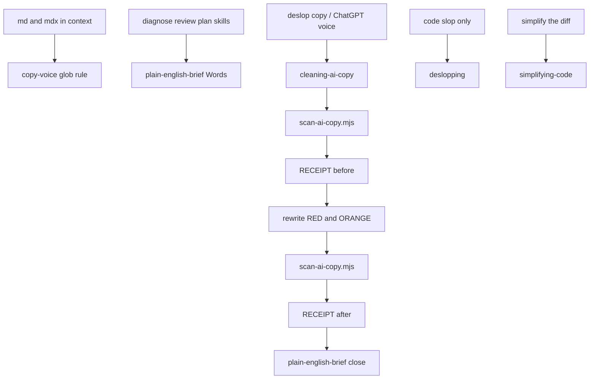

# Plan: AI copy hygiene

## 1. Summary

- Problem: The 2026 copy-tell research is sitting in a canvas, not in the loadout. Agents still ship ChatGPT leftovers, measured-style spikes, not-X-but-Y scaffolds, and landing-page “taxonomy + invariant” headlines into docs, changelogs, and UI strings. [`rules/copy-voice.mdc`](../../rules/copy-voice.mdc) covers a thin slice. [`deslopping`](../../plugins/core-engineering/skills/deslopping/SKILL.md) cleans code slop only. There is no mechanical RECEIPT for prose.
- Outcome: A prevention rule, a cited guideline catalog, a deterministic scanner that prints a RECEIPT, and a cleanup skill plus slash command. Agents rewrite user-facing prose without changing meaning. Code slop stays on `deslopping`.
- Approach (1 paragraph): Keep `copy-voice` as a short glob rule on `**/*.md` and `**/*.mdx`. Put the full tell catalog in a one-hop reference. Ship `scan-ai-copy.mjs` with a curated house list (not the 758-entry fiction corpus). New skill `cleaning-ai-copy` runs the scanner, rewrites RED/ORANGE hits, re-scans, and quotes the RECEIPT. `/deslop-copy` is a thin implement wrapper (no next-prompt fence). Chat diagnose/review/plan replies pick up the structural bans via [`plain-english-brief.md`](../../plugins/core-engineering/skills/_shared/plain-english-brief.md). Do not add `alwaysApply: true`. Do not add the skill to workflow `uses:` or `kits.starter`.

## 2. Scope

### In scope

- Expand [`rules/copy-voice.mdc`](../../rules/copy-voice.mdc) (still `alwaysApply: false`, same globs, still short). Add artifacts, structural scaffolds (including taxonomy + invariant), cluster rule, and a pointer to the cleanup skill.
- Shared guideline reference [`plugins/core-engineering/skills/_shared/ai-copy-tells.md`](../../plugins/core-engineering/skills/_shared/ai-copy-tells.md) (tiers, citations, era-drift note).
- Machine patterns [`plugins/core-engineering/skills/cleaning-ai-copy/references/ai-copy-patterns.json`](../../plugins/core-engineering/skills/cleaning-ai-copy/references/ai-copy-patterns.json).
- Filter script [`plugins/core-engineering/skills/cleaning-ai-copy/scripts/scan-ai-copy.mjs`](../../plugins/core-engineering/skills/cleaning-ai-copy/scripts/scan-ai-copy.mjs) plus node:test fixtures.
- New skill `cleaning-ai-copy` and command `deslop-copy-cmd` (`/deslop-copy`).
- Retarget `deslopping` and `simplifying-code` so prose routes here.
- Add 4–6 lines to the Words section of `plain-english-brief.md` (chat prevention without a new always-on rule).
- Point `changelog`, `summarizing-my-work`, and `weekly-review` at the cleanup skill when a draft still reads like a model.
- Registry, catalog headers (live counts), usage, getting-started route, `docs/external-practices.md` deslop row, plugin `core-engineering` 0.20.0 → 0.21.0, `package.json` test list, `loadout doctor`.

### Non-goals (with rationale)

- Do not constrain every agent reply with an always-on wordlist. That undoes the 2026 always-on shrink just shipped (`context-hygiene`, `agents-md-hygiene`, demoted `no-inline-imports`).
- Do not merge prose cleanup into `deslopping`. Code slop and copy slop have different diffs, guardrails, and false-positive profiles.
- Do not vendor [AIStoryHub_LLM_Cliche_Corpus](https://github.com/AIStoryHub/AIStoryHub_LLM_Cliche_Corpus) (758 fiction clichés). Fiction dialect (Elara, dust motes, voice barely above a whisper) is out of scope for an engineering loadout.
- Do not add a black-box “% AI” detector or treat one em dash as proof. Detectors false-positive ESL and trained-on-web text ([Wikipedia:Signs of AI writing](https://en.wikipedia.org/wiki/Wikipedia:Signs_of_AI_writing)).
- Do not invent a `/review` sibling named as a detector. Cursor `/review` stays the diff review.
- Do not add `cleaning-ai-copy` to any workflow `uses:` list. `update` would then install it for every consumer of that workflow. Registry `workflows` metadata only (same D-07 as adopt-2026-cursor-practice).
- Do not add the skill to `kits.starter`.
- Do not glob `**/*.{ts,tsx}` for `copy-voice`. That taxes every code file. UI strings are cleaned when the user asks or when `cleaning-ai-copy` is given those paths.
- Do not put `next-prompt` in `pairs_with`. Implement skill, no fence. Do not add `/deslop-copy` to `next-prompt-fence.test.mjs` REQUIRED.
- Do not implement this plan until Build or an explicit implement ask.
- Do not edit [`.cursor/plans/2026-09-02-adopt-2026-cursor-practice.md`](2026-09-02-adopt-2026-cursor-practice.md) or its TASK.md.
- Do not add `scan-ai-copy.mjs` as a whole-tree CI gate. Tests run fixtures only. A green RECEIPT is not a “human wrote this” verdict.
- Do not scan rule-of-three, synonym cycling, or marketing `features`/`offers` in the script. Those are skill judgment only (`features`/`offers` explode on product docs).
- Do not add `wink-pos-tagger` or EQ-Bench stage-2 POS contrast. No new npm dependency. Stage-1 regex only.

### Assumptions (labeled; must not block implementation)

- A-01: Prevention is file-glob + brief + on-demand cleanup. Chat replies are not scanned unless the user asks to clean them.
- A-02: Sibling WIP in the working tree (flight-family / plain-english-brief edits) stays untouched except the named Words-section addition.
- A-03: Plugin pair versions are not required to match. Bump `core-engineering` only (0.20.0 → 0.21.0). `meta` stays 0.3.0.
- A-04: Catalog Skills header becomes 62, Rules stays 40, Commands becomes 23. Confirm from live `registry.json` after the adds.
- A-05: Shared-trunk isolation. No branch, stash, or worktree.
- A-06: The catalog, fixtures, and this plan file contain the banned tokens on purpose. The scanner’s default exclude list (R-15) is what keeps a session scan from failing on its own docs.
- A-07: `plain-english-brief.md` Words stays structural (leftover cite tokens, not-X-but-Y, taxonomy + invariant). It does not paste Kobak tokens (`delve`, `tapestry`). Those live only in `ai-copy-tells.md` and `ai-copy-patterns.json`.

### Open questions

<!-- Must be EMPTY at delivery. -->

## 3. Current state (in-repo, evidence-based)

- What exists today:
  - [`rules/copy-voice.mdc`](../../rules/copy-voice.mdc): glob `**/*.md`, `**/*.mdx`; bans em dashes, seamlessly/effortlessly/robust/leverage/elevate, “in today's fast-paced world”, “it's important to note”, delve, “It's not just X, it's Y”.
  - `deslopping`: narrating comments, `any`, over-abstraction. `pairs_with` includes `copy-voice` but the body never applies it to prose.
  - `changelog.md`, `summarizing-my-work`, `weekly-review`, `updating-docs` mention `copy-voice`.
  - `_shared/plain-english-brief.md`: diagnose/review/plan voice. No AI-tell list.
  - `_shared/scripts/shortcut-sweep.sh` and `hunting-defects/scripts/census.sh`: RECEIPT pattern to copy.
  - No repo-root `scripts/`. Skill-local `scripts/` is the house place for mechanical greps.
  - Always-on set is already tiny (`no-shortcuts`, `regression-test`, `no-secrets-in-code` plus kit trio). `copy-voice` is glob-only.
- Gaps / constraints:
  - No artifact leftover list (`oaicite`, `turn0search`, Gemini `[cite: N]`).
  - No dangling `-ing`, `serves as` / `stands as` / `boasts`, rule-of-three, cluster scoring.
  - No “taxonomy + invariant” headline: category label with no verb, then a short absolute guarantee (“Named credentials for agents. The model never sees the value.”).
  - No RECEIPT an agent must quote (skill-author: a grep the agent can fake must be a script).
  - Doctor: SKILL.md body ≤500 lines; `pairs_with` must appear in `## Pairs with`; catalog Skills/Rules headers must match registry.
  - `no-regex-for-semantics`: regex is structural. The scanner flags tokens and scaffolds, not “this paragraph sounds like GPT.” The skill does the rewrite.
- Reusable components:
  - RECEIPT echo style from `shortcut-sweep.sh`.
  - Command thin-wrapper style from [`commands/simplify.md`](../../plugins/core-engineering/commands/simplify.md).
  - Registry command row style from `simplify-cmd`.
  - `plain-english-brief.md` for the skill’s user-facing close.
  - `gray-matter` already in `package.json`; scanner uses Node stdlib only (no new dependency).
- Files read (path — why):
  - `rules/copy-voice.mdc` — current prevention surface
  - `plugins/core-engineering/skills/deslopping/SKILL.md` — code-only scope
  - `plugins/core-engineering/skills/_shared/plain-english-brief.md` — chat voice
  - `plugins/core-engineering/skills/skill-author/SKILL.md` — scripts + progressive disclosure
  - `plugins/core-engineering/commands/simplify.md` — implement command, no fence
  - `plugins/core-engineering/commands/next-prompt-fence.test.mjs` — REQUIRED list
  - `plugins/core-engineering/skills/getting-started/SKILL.md` — route table
  - `docs/catalog.md`, `docs/usage.md`, `docs/external-practices.md` — wiring
  - `cli/src/commands/doctor.ts` — pairs_with + catalog counts
  - `package.json` — explicit test list
  - `registry.json` — `deslopping`, `copy-voice`, `simplify-cmd`
  - `plugins/core-engineering/.claude-plugin/plugin.json` — 0.20.0
  - `plugins/core-engineering/skills/task-topology/references/task-file.md` — TASK.md contract
  - `plugins/core-engineering/skills/_shared/scripts/plan-ban-sweep.sh` — plan bans
  - `plugins/core-engineering/skills/create-plan/references/plan-template.md` — this file

## 4. External research

### Questions investigated

1. Which markers are near-proof vs density-only?
2. Which word lists are measured (papers) vs folk (detectors)?
3. How do existing “humanizer” / slop-score tools tier findings?
4. What must stay out of an engineering loadout (fiction dialect, % AI scores)?
5. How do Cursor 2026 rules load so a 300-word ban list is not always-on?
6. How to catch the landing-page beat “X for Y. Z never happens” without flagging real security docs?
7. How do published slop scanners avoid self-hits and POS-tagger deps?
8. Which Wikipedia leftover tokens and chat phrases are missing from the house list?

### Sources consulted

| Source | URL | Takeaway |
| ------ | --- | -------- |
| Wikipedia: Signs of AI writing | https://en.wikipedia.org/wiki/Wikipedia:Signs_of_AI_writing | Cluster, do not single-marker. Artifacts and leftover UI are near-proof. ESL false positives on detectors. |
| Kobak et al. | https://arxiv.org/abs/2406.07016 | PubMed excess: delve/delves ~25×; also underscore, intricate, showcasing, realm, tapestry. Code: https://github.com/berenslab/chatgpt-excess-words |
| Juzek & Ward | https://arxiv.org/abs/2412.11385 | Style-word spikes; common stack (across, additionally, comprehensive, crucial, enhancing, exhibited, insights, notably, particularly, within). Code: https://github.com/tjuzek/delve |
| EQ-Bench slop-score | https://eqbench.com | 60% words / 25% not-X-but-Y / 15% trigrams. Structural scaffolds outlast word lists. |
| AIStoryHub cliché corpus | https://github.com/AIStoryHub/AIStoryHub_LLM_Cliche_Corpus | 758 MIT JSON; fiction-heavy. Do not vendor whole file. |
| avoid-ai-writing | https://github.com/conorbronsdon/avoid-ai-writing | Tiered vocab (always / cluster / density). Adapt the tier idea. |
| brandonwise/humanizer | https://github.com/brandonwise/humanizer | Rewrite guidance, not a people-process detector. |
| monali7-d / antydizajn slop detectors | https://github.com/monali7-d/ai-slop-detector , https://github.com/antydizajn/ai-slop-detect | Heuristic CLIs; treat as inspiration for RECEIPT shape, not as a verdict. |
| Sean Goedecke on em dashes | https://www.seangoedecke.com/em-dashes/ | Models overuse U+2014; hard to prompt away; weak as a single marker. |
| SlopScoreTool methodology | https://github.com/lemon07r/SlopScoreTool/blob/main/docs/methodology.md | EQ-Bench stage-2 POS contrast measured delta zero vs stage-1. Reject wink-pos-tagger. |
| sam-paech/slop-score | https://github.com/sam-paech/slop-score | 60/25/15 words / not-X-but-Y / trigrams. Not an AI-or-human classifier. |
| henkisdabro humanise skill | https://github.com/henkisdabro/wookstar-claude-plugins/blob/main/plugins/humanise/skills/humanise/SKILL.md | Wikipedia-synced checklist (2026-07-12): copula, chat artifacts, sycophancy. Catalog yes; do not vendor their full list. |
| WikiProject AI Cleanup | https://en.wikipedia.org/wiki/Wikipedia:AIDETECT | As of Aug 2026, AISIGNS word lists lag newest models. Durable layer = scaffolds + leftovers. |
| Muñoz-Ortiz et al. | https://arxiv.org/abs/2308.09067 | Rhythm: more uniform sentence length, fewer adjectives. Scanner can count dash density and sentence-length variance; the skill judges rhythm. |
| Cursor rules modes (usage.md) | in-repo `docs/usage.md` | Always / glob / agent-requested / manual. Language constraints use globs. |
| House observation (this thread) | sibling chat, 2026-09-08 | Taxonomy + invariant: “X for Y. Z never happens.” Category label, then a solemn present-tense guarantee. Schema leak (“the value”). Even two-beat rhythm. No person in the sentence. |

### State of the art / common practice

Identify AI copy by **clusters**, in this strength order:

1. Chat UI leftovers (near-proof): `oaicite`, `contentReference`, `turn0search`, `utm_source=chatgpt.com`, Gemini `[cite: N]`, DeepSeek `【…†…】`, Perplexity `[web:1]`, “Would you like me to…”, “Regenerate response”.
2. Measured style words (Kobak / Juzek): delve, underscore(s), intricate, showcasing, realm, tapestry, landscape — plus the common stack as cluster-only.
3. Scaffolds: “It’s not X, it’s Y”; `serves as` / `stands as` / `boasts`; dangling `-ing` (`highlighting` / `ensuring` / `reflecting`); rule of three; weasel “experts say”; “in today’s fast-paced world”; Challenges / Future Outlook closers; **taxonomy + invariant** (“X for Y. Z never happens.”).
4. Promotional inflation: testament, pivotal, evolving landscape, nestled.
5. Rhythm: uniform 10–20 word sentences, low burstiness.
6. Em dash density (weak alone).
7. Black-box % AI (unsafe for people-process).

Era drift: GPT-4 favored delve/tapestry/testament; GPT-4o favored align with/fostering/showcasing; GPT-5 favored emphasizing/enhance/highlighting. Word lists go stale. Scaffolds and leftovers do not.

### Pitfalls & anti-patterns to avoid

- One em dash or one “however” as proof.
- Embryo-style lists that include “for example” (false-positive storm).
- Always-on 300-word ban list (token tax; fights 2026 Cursor practice).
- Folding prose into `deslopping` so a code-only trigger rewrites comments as marketing.
- Treating the scanner as semantic (violates `no-regex-for-semantics`). It is a token/scaffold RECEIPT.
- Shipping a “% AI written” number on a teammate’s docs.
- Flagging every “never” in a threat model, or “the value” in an API field table. Taxonomy + invariant is a headline pair, not a schema doc.

### Implications for this plan

- Adopt: Wikipedia cluster rule; Kobak/Juzek measured words as RED; Juzek common stack as ORANGE cluster (≥2 in one paragraph); EQ-Bench stage-1 not-X-but-Y as RED scaffold; leftover artifacts as RED (including `oai_citation`, `grok_card`); taxonomy + invariant as a named house scaffold (D-05); chat leftovers `I hope this helps` / `You're absolutely right`.
- Adapt: avoid-ai-writing tiers → RED / ORANGE / YELLOW in JSON + RECEIPT. Humanise-style checklists → skill reference, not always-on.
- Reject: full fiction corpus; always-on wordlist; black-box detector as a gate; merging with `deslopping`; EQ-Bench stage-2 POS (`wink-pos-tagger`); scanning `features`/`offers`; whole-tree CI gate.

## 5. Requirements

### Functional (EARS, R-01…)

- R-01: When the agent writes or edits `*.md` / `*.mdx`, the `copy-voice` rule SHALL load via existing globs and SHALL forbid leftover artifacts, not-X-but-Y, `serves as` / `stands as` / `boasts`, taxonomy + invariant headlines, and the named filler already in the rule.
- R-02: The `copy-voice` rule SHALL remain `alwaysApply: false` and SHALL stay under 80 lines.
- R-03: When a user asks to deslop copy, clean AI voice, or remove ChatGPT tells from named paths or the session prose diff, the agent SHALL invoke `cleaning-ai-copy` (or `/deslop-copy`).
- R-04: `cleaning-ai-copy` SHALL run `scan-ai-copy.mjs` before and after edits and SHALL quote both RECEIPT blocks in the reply.
- R-05: The scanner SHALL classify hits as RED, ORANGE, or YELLOW using `ai-copy-patterns.json` and SHALL print a RECEIPT with `file:`, `tier:`, `pattern:`, `line:`, then `hits_red:`, `hits_orange:`, `hits_yellow:`, `END`.
- R-06: The scanner SHALL exit `1` when `hits_red > 0` or `hits_orange > 0`, else `0`. YELLOW-only is exit `0` (advisory).
- R-07: The skill SHALL rewrite RED and ORANGE hits without changing the claimed meaning. YELLOW (dash density, low sentence-length variance) SHALL be rewritten only when the user asked for a full pass or when the same paragraph already has RED/ORANGE.
- R-08: When the ask is code slop only (narrating comments, `any`, over-abstraction), the agent SHALL use `deslopping` and SHALL NOT run `cleaning-ai-copy` on those files unless they also contain user-facing prose.
- R-09: When the ask is YAGNI / flatten the diff, the agent SHALL use `simplifying-code`.
- R-10: Diagnose/review/plan skills that load `plain-english-brief.md` SHALL avoid the structural bans listed in its Words section (leftover cite tokens, not-X-but-Y, taxonomy + invariant, “in today’s fast-paced world”). Measured tokens live in `ai-copy-tells.md`, not in the brief.
- R-11: Registry `pairs_with` for `cleaning-ai-copy` SHALL be `copy-voice`, `deslopping`, `simplifying-code`, `deslop-copy-cmd` only. No `next-prompt`.
- R-12: `loadout doctor` SHALL be clean. Catalog `## Skills (N)` and `## Rules (N)` SHALL match registry counts after the add.
- R-13: No new `alwaysApply: true` rule. No new workflow `uses:` entry. `kits.starter` unchanged.
- R-14: `cleaning-ai-copy` SHALL treat taxonomy + invariant as a rewrite target: put a person or a concrete noun in the line; keep the promise; drop schema words (`the value`) from headlines. Example target: “Your agent can call Stripe. It never gets the key.”
- R-15: The scanner SHALL default-exclude `**/ai-copy-tells.md`, `**/ai-copy-patterns.json`, `**/cleaning-ai-copy/scripts/fixtures/**`, `**/.cursor/plans/**`, `**/.loadout/tasks/**`. `--include-self` opts back in. `npm test` SHALL invoke the scanner only on fixtures.
- R-16: `[.claude-plugin/marketplace.json](../../.claude-plugin/marketplace.json)` `plugins[name=core-engineering].version` and `[plugins/core-engineering/.claude-plugin/plugin.json](../../plugins/core-engineering/.claude-plugin/plugin.json)` `version` SHALL both become `0.21.0`. Marketplace root `version` SHALL become `0.21.0`. Doctor warns on catalog vs plugin.json mismatch (`cli/src/commands/doctor.ts` lines 99–103).
- R-17: `SKILL.md` SHALL invoke the script as the `scripts/scan-ai-copy.mjs` file beside the skill (vendored path `.cursor/skills/cleaning-ai-copy/scripts/scan-ai-copy.mjs`), not a loadout-repo path.
- R-18: Bare `underscore` SHALL NOT be a hit. Hits are `underscoring`, `underscore the`, `underscores the` only.
- R-19: Em-dash YELLOW SHALL match U+2014 and U+2013 only, not ASCII hyphen-minus.

### Non-functional

- Scanner: Node ≥18, stdlib only, no new npm dependency.
- Skill body: 150–250 lines target, hard cap 500; catalog lives in references.
- Rule body: short enough that glob-attach is cheap.
- House list: curated; each RED/ORANGE token cited (Kobak, Juzek, Wikipedia, EQ-Bench, or “house scaffold”) in `ai-copy-tells.md`.
- Lists go stale: `ai-copy-tells.md` SHALL state that word lists drift by model era and that scaffolds/artifacts (including taxonomy + invariant) are the durable layer.

### Acceptance criteria (Given/When/Then, AC-01…)

- AC-01: Given the slop fixture (delve + not-X-but-Y + `oaicite` + “serves as”), when `scan-ai-copy.mjs` runs, then RECEIPT lists those hits as RED and exit code is 1.
- AC-02: Given the clean fixture (plain engineering notes, no banned tokens), when the scanner runs, then `hits_red` and `hits_orange` are 0 and exit code is 0.
- AC-03: Given a paragraph with two Juzek common-stack words and no RED tokens, when the scanner runs, then those hits are ORANGE and exit code is 1.
- AC-04: Given a file whose only tell is one em dash, when the scanner runs, then the hit is YELLOW and exit code is 0.
- AC-11: Given the fixture `Named credentials for agents. The model never sees the value.`, when the scanner runs, then RECEIPT includes RED `taxonomyInvariant` and exit code is 1.
- AC-12: Given a schema doc line `The value field is a string` with no never-* pair, when the scanner runs, then `the value` is not a hit.
- AC-13: Given `Never commit .env.` alone, when the scanner runs, then that line is not a `solemnInvariant` hit.
- AC-05: Given `copy-voice.mdc` after the change, when `rules/frontmatter-modes.test.mjs` and doctor run, then `alwaysApply` is false and globs are still `**/*.md` and `**/*.mdx`.
- AC-06: Given `getting-started/SKILL.md` after T-04, when read, then the body contains the literal `cleaning-ai-copy` and does not invent a `/review` sibling for copy.
- AC-07: Given `deslopping/SKILL.md`, when read, then the body contains `cleaning-ai-copy` and states that prose / ChatGPT voice is not this skill’s job.
- AC-08: Given `/deslop-copy`, when `next-prompt-fence.test.mjs` runs, then `deslop-copy` is absent from REQUIRED and the command file has no next-prompt fence.
- AC-09: Given registry after the add, when doctor runs, then `pairs_with` on `cleaning-ai-copy` appears in its `## Pairs with` and no id is dangling.
- AC-10: Given `npm test`, `npm run build`, and `npm run doctor`, when the change is complete, then all three exit 0 and doctor prints no version-mismatch warning for `core-engineering`.
- AC-14: Given default excludes, when the scanner is pointed at `ai-copy-tells.md` (or no `--include-self`), then that file produces zero hits. `--include-self` on the same file may report RED examples.
- AC-15: Given `plain-english-brief.md` after T-02, when searched, then it does not contain the literals `delve`, `tapestry`, or `oaicite`.
- AC-16: Given `Retry for 429. The model never sees the token.`, when the scanner runs, then there is no RED `taxonomyInvariant` (first clause is an imperative). `solemnInvariant` ORANGE on `never sees` is allowed.
- AC-17: Given `copy-voice.mdc` after T-02, when the body after frontmatter is counted, then it has fewer than 80 lines and `alwaysApply` is false.
- AC-18: Given marketplace and plugin manifests after T-04, when read, then both `core-engineering` versions and the marketplace root version are `0.21.0`.
- AC-19: Given `registry.json` `kits.starter`, when read, then it does not contain `cleaning-ai-copy` or `deslop-copy-cmd`.
- AC-20: Given `cleaning-ai-copy/SKILL.md` frontmatter `description`, when read, then it contains `deslop copy` and `Anti-triggers` and names `deslopping`.

### Edge cases & error paths

- Empty path list: scanner defaults to `git status --porcelain` text files with `*.md` / `*.mdx` / `*.txt`, plus any `*.md` in the session diff. If still empty, RECEIPT `note: no files` and exit 0.
- Binary / lockfiles: skip (same `is_text` idea as shortcut-sweep).
- Code files passed explicitly: scan string literals and markdown-in-comments only if `--include-code` is set; default skip `*.{ts,tsx,js,jsx}` so `deslopping` remains the code path.
- False friends: do not flag “however”, “for example”, “therefore”, “moreover” alone. Do not flag “the value” in field tables. Do not flag a lone imperative “Never commit secrets.”
- Idempotent rewrite: second scan after a clean rewrite is exit 0; if the agent cannot remove a RED without changing meaning, it stops and asks (no silent leave-behind).
- Concurrent agents: shared tree; if the same prose file is mid-edit by a sibling, stop and ask (shared-working-tree).
- Self-hit: a session `git status` scan after T-02+T-03 must not fail on `ai-copy-tells.md`, fixtures, or this plan (R-15).
- Imperative + `for` + never-* pair: not RED taxonomy (AC-16).

## 6. Design decisions (mini-ADRs)

### D-01: Expand `copy-voice` vs new always-on rule

- Context: Need prevention without burning tokens every request.
- Options: (A) `alwaysApply: true` wordlist; (B) new agent-requested duplicate rule; (C) expand existing glob `copy-voice` and put chat bans in `plain-english-brief.md`.
- Decision: C.
- Informed by: in-repo `docs/usage.md` rule modes; adopt-2026-cursor-practice (no new always-on); Cursor glob attach.
- Consequences: md/mdx get the rule automatically. Chat briefs get a short Words add. Cleanup is a skill, not a rule.

### D-02: New `cleaning-ai-copy` vs fold into `deslopping`

- Context: User asked for cleanup of “this language.” `deslopping` already exists.
- Options: (A) widen `deslopping` to prose; (B) new skill; (C) detect-only skill plus a separate rewrite skill.
- Decision: B. Detect is step 1 of the same skill (`--report-only` flag on the script for a dry run).
- Informed by: current `deslopping` body (code only); skill-author rule-vs-skill test; `simplifying-code` already splits YAGNI from slop.
- Consequences: Three named jobs: code slop / copy slop / YAGNI. Descriptions must anti-trigger each other.

### D-03: Script RECEIPT vs LLM-only grep

- Context: Agents fake “I grepped for delve.”
- Options: (A) skill says “search for these words”; (B) `scan-ai-copy.mjs` prints RECEIPT the report must quote.
- Decision: B.
- Informed by: skill-author “scripts for fragile mechanical steps”; `shortcut-sweep.sh` / `census.sh`; `no-regex-for-semantics` (script is structural; rewrite is the skill).
- Consequences: Tests can lock fixtures. Report without a quoted RECEIPT is incomplete.

### D-04: Vendor 758 corpus vs curated house list

- Context: AIStoryHub is MIT and large. Kobak lists are measured.
- Options: (A) vendor full JSON; (B) curated house JSON with citations; (C) no list, LLM judgment only.
- Decision: B.
- Informed by: doctor/size; fiction out of scope; Kobak/Juzek measurements; era drift (full lists rot).
- Consequences: Update the JSON when a new measured paper lands. Scaffolds stay even when words drift.

### D-05: Taxonomy + invariant — scanner vs skill-only

- Context: “Named credentials for agents. The model never sees the value.” is a category label plus a security koan. A person says “Your agent can call Stripe. It never gets the key.” The first clause is a taxonomy (no verb, no you). The second is an absolute present-tense guarantee with a system actor and a schema noun (`the value`). Rhythm is two even beats. Nobody is in the sentence.
- Options: (A) skill-only judgment (scanner misses it); (B) flag every `never sees/stored/leaves/shared` and every `the value` (false positives on APIs and threat models); (C) pair heuristic + a short phrase list; skill rewrites scene, person, and concrete noun.
- Decision: C.
- Informed by: house observation (this thread); `no-regex-for-semantics` (pairing is structural; “nobody in the sentence” is the skill); Stripe / Linear / Vercel landing-page overfitting named in the insight.
- Consequences: Scanner RED `taxonomyInvariant` when a verbless “X for Y” fragment is immediately followed by a never-* guarantee. First clause must not start with an imperative from `{retry, never, do, don't, run, set, add, fix}`. Scanner ORANGE `solemnInvariant` on `never sees` / `never stored` / `never leaves` / `never shared` / `the model never` when not in that pair. Scanner ORANGE `schemaLeak` on `the value` only when it co-occurs with a never-* hit in the same paragraph. Skill rewrite checklist: add you or a concrete noun; keep the promise; drop the category-label H1.

### D-06: Self-hit exclusion vs comment pragmas

- Context: `ai-copy-tells.md`, fixtures, and this plan quote `delve`, `oaicite`, and the taxonomy pair. A default `git status` scan after implement would fail the skill’s own re-scan.
- Options: (A) `# ai-copy-scan: skip` comments in every example; (B) default path excludes + brief does not paste token lists; (C) never scan untracked files.
- Decision: B.
- Informed by: shortcut-sweep already skips binaries by extension; Wikipedia leftover examples would poison any self-scan; A-06/A-07.
- Consequences: R-15 + AC-14 + AC-15. SKILL.md points at the reference and does not paste the Kobak list.

## 7. Technical design

### Architecture / data flow



### Data model & migrations

- `ai-copy-patterns.json` shape:

```json
{
  "red": {
    "artifacts": ["oaicite", "contentReference", "oai_citation", "turn0search", "utm_source=chatgpt.com", "grok_card"],
    "artifactRegex": ["\\\\[cite:\\\\s*\\\\d+\\\\]", "【[^】]*†[^】]*】", "\\\\[web:\\\\d+\\\\]"],
    "phrases": ["Would you like me to", "Regenerate response", "I hope this helps", "You're absolutely right", "in today's fast-paced world", "it's important to note"],
    "words": ["delve", "delves", "delving", "tapestry", "intricate", "showcasing", "realm"],
    "verbPhrases": ["underscoring", "underscore the", "underscores the"],
    "scaffolds": ["notXbutY", "servesAs", "standsAs", "boasts", "taxonomyInvariant"]
  },
  "orange": {
    "clusterWords": ["across", "additionally", "comprehensive", "crucial", "enhancing", "exhibited", "insights", "notably", "particularly", "within"],
    "clusterThreshold": 2,
    "promo": ["testament", "pivotal", "nestled", "evolving landscape"],
    "danglingIng": ["highlighting", "ensuring", "reflecting", "emphasizing", "fostering", "aligning"],
    "solemnInvariant": ["never sees", "never stored", "never leaves", "never shared", "the model never"],
    "schemaLeakWithInvariant": ["the value"]
  },
  "yellow": {
    "emDash": true,
    "emDashChars": ["\u2014", "\u2013"],
    "emDashDensityPerThousand": 8
  }
}
```

- `notXbutY`: regex for `it's not (just )?X[,.] it's Y` and `not X, but Y` (case-insensitive). Tune in the test fixture so AC-01 stays green.
- `taxonomyInvariant`: sentence N-1 is a short fragment (≤12 words, contains `\bfor\b`, no finite verb from `{is,are,can,will,does,has,have,get,gets,store,stores,keep,keeps,let,lets,stop,use,uses}`, does not start with `{retry,never,do,don't,run,set,add,fix}`), and sentence N matches a `solemnInvariant` phrase. Pattern id in RECEIPT: `taxonomyInvariant`.
- `solemnInvariant`: phrase hit when not already consumed by a `taxonomyInvariant` pair.
- `schemaLeak`: `the value` only when the same paragraph also has a `solemnInvariant` or `taxonomyInvariant` hit. Field tables stay quiet (AC-12).
- No database. No KV. No prompt registry.

### APIs / tools / jobs / UI surfaces

- Script CLI: `node <skill-dir>/scripts/scan-ai-copy.mjs [--report-only] [--include-code] [--include-self] [paths…]` where `<skill-dir>` is the directory of the vendored `SKILL.md`.
- Slash: `/deslop-copy` → run the skill. `$ARGUMENTS` = focus / paths.
- Cursor `/review` unchanged.
- No MCP. No canvas required for the scanner (RECEIPT is the deliverable).

### Failure modes & retries / idempotency

- Scanner crash: skill stops, pastes stderr, does not claim clean.
- Rewrite introduces new RED: one more rewrite pass, then stop and show the remaining RECEIPT.
- Meaning would change: ask. Do not silently drop a claim to clear the scanner.

### Feature flags / KV / prompt registry (if any)

- N/A — no flags, KV, or prompt registry.

### Security, privacy, tenancy notes

- Scanner reads local text only. Do not send file bodies to a third-party detector API.
- Do not print a “% AI” score that could be used as a people-process verdict.

## 8. Implementation tasks

### T-01: Scanner + fixtures

- Depends on: none
- Touch: `.loadout/tasks/ai-copy-hygiene/TASK.md` (already written; keep in sync if topology text drifts), `plugins/core-engineering/skills/cleaning-ai-copy/references/ai-copy-patterns.json`, `plugins/core-engineering/skills/cleaning-ai-copy/scripts/scan-ai-copy.mjs`, `plugins/core-engineering/skills/cleaning-ai-copy/scripts/scan-ai-copy.test.mjs`, `plugins/core-engineering/skills/cleaning-ai-copy/scripts/fixtures/slop.md`, `plugins/core-engineering/skills/cleaning-ai-copy/scripts/fixtures/clean.md`, `plugins/core-engineering/skills/cleaning-ai-copy/scripts/fixtures/cluster.md`, `plugins/core-engineering/skills/cleaning-ai-copy/scripts/fixtures/dash-only.md`, `plugins/core-engineering/skills/cleaning-ai-copy/scripts/fixtures/taxonomy.md`, `plugins/core-engineering/skills/cleaning-ai-copy/scripts/fixtures/schema-value.md`, `plugins/core-engineering/skills/cleaning-ai-copy/scripts/fixtures/never-commit.md`, `plugins/core-engineering/skills/cleaning-ai-copy/scripts/fixtures/retry-for.md`, `package.json` (`test` script adds the new test file)
- Do: Implement stdlib scanner and lock AC-01–AC-04, AC-11–AC-14, AC-16. Tests pass fixture paths only (never `**/*.md` of this repo). Default excludes per R-15. `retry-for.md` locks AC-16.
- Acceptance: `node --import tsx --test plugins/core-engineering/skills/cleaning-ai-copy/scripts/scan-ai-copy.test.mjs` green.
- Verify: that command.

### T-02: Prevention + guidelines

- Depends on: T-01 (patterns exist so the reference can cite the same tokens)
- Touch: `rules/copy-voice.mdc`, `plugins/core-engineering/skills/_shared/ai-copy-tells.md`, `plugins/core-engineering/skills/_shared/plain-english-brief.md`
- Do: Expand the rule (still <80 lines, same frontmatter mode). Write the cited catalog (RED/ORANGE/YELLOW, era note, fiction out of scope, taxonomy + invariant with the bad/good pair). Add Words bullets to the brief that stay structural (leftover cite tokens, not-X-but-Y, taxonomy + invariant, “in today’s fast-paced world”). Do not paste `delve` / `tapestry` / `oaicite` into the brief (AC-15). `copy-voice` gets one short bullet: no category-label + koan; start with a person or a concrete noun.
- Acceptance: AC-05, AC-15, AC-17; brief still leads with What’s going on / What we need to do / Decision; no alwaysApply flip.
- Verify: `node --import tsx --test rules/frontmatter-modes.test.mjs`; read the three files.

### T-03: Cleanup skill + command + neighbor retargets

- Depends on: T-01, T-02
- Touch: `plugins/core-engineering/skills/cleaning-ai-copy/SKILL.md`, `plugins/core-engineering/commands/deslop-copy.md`, `plugins/core-engineering/skills/deslopping/SKILL.md`, `plugins/core-engineering/skills/simplifying-code/SKILL.md`, `plugins/core-engineering/commands/simplify.md` (one-line distinct-from)
- Do: House skill (Trigger, numbered Workflow, Suggested Checks, Guardrails, Pairs with). Workflow: scope paths → scan (script beside this SKILL.md) → quote RECEIPT → rewrite RED/ORANGE → re-scan → plain-english-brief. Do not paste the Kobak list into SKILL.md. Rewrite checklist includes taxonomy + invariant: add you or a concrete noun; keep the promise; replace `the value` with the key / the secret / it. Description trigger terms: “deslop copy”, “AI voice”, “ChatGPT”, “clean the copy”, “sounds like a model”. Anti-triggers: code slop → `deslopping`; YAGNI → `simplifying-code`. Command file is `deslop-copy.md` (vendors to `.cursor/commands/deslop-copy.md`). No fence. `/deslop` alone is not this command.
- Acceptance: AC-07, AC-08, AC-20. Doctor composition will pass once T-04 registers pairs_with.
- Verify: file exists; description contains trigger terms; deslopping body names `cleaning-ai-copy`.

### T-04: Registry, docs, plugin, gates

- Depends on: T-03
- Touch: `registry.json` (skill + command; add `cleaning-ai-copy` to `deslopping` and `simplifying-code` `pairs_with`), `docs/catalog.md` (Skills 62, Commands 23, new rows, `copy-voice` gist, `deslopping` gist), `docs/usage.md` (one paragraph on the split), `docs/external-practices.md` (deslop row + new skill row), `plugins/core-engineering/skills/getting-started/SKILL.md` (route row with literal `cleaning-ai-copy`), `plugins/core-engineering/commands/changelog.md`, `plugins/core-engineering/skills/summarizing-my-work/SKILL.md`, `plugins/core-engineering/skills/weekly-review/SKILL.md`, `plugins/core-engineering/.claude-plugin/plugin.json` (0.21.0), `.claude-plugin/marketplace.json` (root version and `core-engineering` plugin entry both 0.21.0)
- Do: Wire everything. Count headers from live registry. Do not add workflow `uses:`. Do not change `kits.starter`. Add description-routing asserts (AC-06, AC-07, AC-20) to `rules/frontmatter-modes.test.mjs` or the scanner test file — file contents, not “the agent would route.”
- Acceptance: AC-06, AC-09, AC-10, AC-18, AC-19, AC-20.
- Verify: `npm test`, `npm run build`, `npm run doctor`.

## 9. Test plan

- Tests to add or extend:
  - `scan-ai-copy.test.mjs`: slop RED+exit 1; clean exit 0; cluster ORANGE+exit 1; dash-only YELLOW+exit 0 (U+2014 only); taxonomy pair RED+exit 1; schema-value quiet; never-commit quiet; retry-for no RED taxonomy; default exclude of catalog; empty paths RECEIPT `note: no files`. Tests call the script with fixture paths only.
  - Existing `rules/frontmatter-modes.test.mjs` still passes for `copy-voice`.
  - Existing `next-prompt-fence.test.mjs` unchanged (no new REQUIRED name).
- Regression cases (fails-before / passes-after) if fixing a bug:
  - N/A — new surface. Before: no scanner. After: fixtures lock the contract.
- Gate commands expected green (`pnpm -r typecheck`, affected package tests):
  - `npm test`
  - `npm run build`
  - `npm run doctor`
- Manual / smoke checks (only what automation cannot cover):
  - Read skill description aloud against AC-06 routing phrases.
  - Confirm `kits.starter` and workflow `uses:` diffs are empty.

## 10. Rollout & rollback

- Ship steps: implement T-01→T-04 on shared trunk; leave unstaged until the user asks to commit. Consumers pick up `cleaning-ai-copy` on `loadout update` of `core-engineering` 0.21.0. Glob `copy-voice` updates in place.
- Rollback (incl. data): revert the change set. No data migration. Remove the skill directory and registry rows if rolling back a release.
- Monitoring signals: `loadout doctor` on this repo; consumer `update` should not newly install the skill unless they `loadout add cleaning-ai-copy` or install the whole plugin. Workflow `uses:` unchanged so update does not force-install.

## 11. Risk register

| Risk | Likelihood | Impact | Mitigation |
| ---- | ---------- | ------ | ---------- |
| Scanner false positives on honest technical prose (“within”, “across”) | Medium | Medium | Those tokens are ORANGE cluster-only (≥2 per paragraph), never RED alone |
| Always-on creep in review | Medium | High | AC-05 + frontmatter test; D-01 locks glob + brief |
| Agents still skip the script | Medium | Medium | Skill forbids done without a quoted RECEIPT; same pattern as shortcut-sweep |
| Word list stale after next model era | High | Low | Document era drift; keep scaffolds/artifacts as the durable layer |
| Sibling WIP collision on `plain-english-brief.md` | Medium | Medium | Touch only the Words section; if the file is conflicted, stop and ask |
| Users treat RECEIPT as a people-process % AI score | Low | High | Skill + reference forbid % scores and detector APIs |
| Self-scan fails the skill on its own catalog | High | High | R-15 default excludes; brief omits token literals (D-06) |
| `/deslop` hits `deslopping` and rewrites comments | Medium | High | Descriptions anti-trigger; command is `/deslop-copy` only |
| Someone wires the scanner to CI on all markdown | Medium | High | Non-goal: fixtures only; no whole-tree gate |
| New model era, word list stale, RECEIPT stays green | High | Medium | Document that clean ≠ human; scaffolds/leftovers are the durable layer |

## 12. Definition of done

- [ ] All ACs pass
- [ ] Typecheck + affected tests green
- [ ] Docs / changelog / surfaces registered in the SAME change
- [ ] No stubs or deferred dependencies left in-scope
- [ ] External research recorded and reflected in decisions
- [ ] plan-ban-sweep RECEIPT quoted; `plan-checker` PASS

## 13. Review changelog (2026-09-08 review-plan)

P0

- Self-hit: catalog, fixtures, and this plan quote banned tokens. Added D-06, R-15, AC-14, AC-15. Brief and SKILL.md must not paste Kobak literals.
- Marketplace is required, not optional. Doctor warns when `.claude-plugin/marketplace.json` `core-engineering` version ≠ `plugin.json`. Locked R-16, AC-18, T-04 touch list.

P1

- AC-06 was “the agent would route.” Replaced with file-content asserts (AC-06, AC-20) plus `deslop` vs `/deslop-copy` anti-triggers.
- Script path is the vendored skill directory (R-17), not a loadout-repo absolute path.
- Bare `underscore` is a false friend in code docs (R-18). Em dash is U+2014/U+2013 only (R-19).
- Taxonomy false friend `Retry for 429. The model never sees the token.` (AC-16).
- Reject EQ-Bench stage-2 POS and whole-tree CI. Added leftover tokens `oai_citation`, `grok_card` and chat phrases from Wikipedia / humanise (2026-07-12).
- `kits.starter` assert AC-19. `copy-voice` line-count AC-17.

P2

- Fixed Goedecke URL to https://www.seangoedecke.com/em-dashes/. Dropped bare `landscape` from RED words (kept `evolving landscape` in promo). Rule of three stays skill-only.
